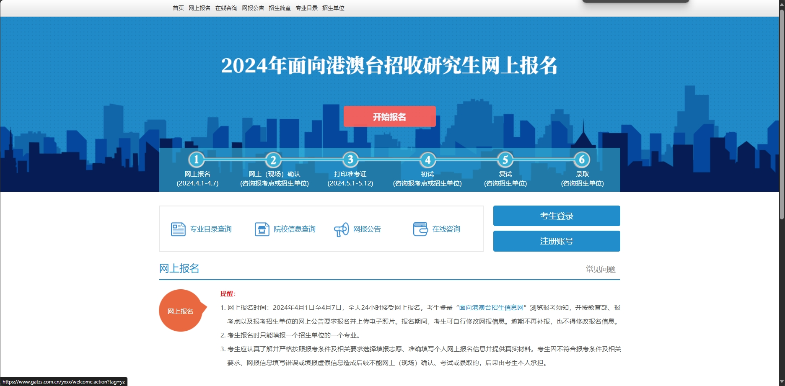

# 港澳台考研

<figure><figcaption></figcaption></figure>

[https://www.gatzs.com.cn/z/gatyz/](https://www.gatzs.com.cn/z/gatyz/)

**港澳台生如果想在国内读研究生，那么港澳台考研是比较大众的一个选择。但注意，填报志愿的时候只能选一个，不能选多个。我身边有两个香港的兄弟，都通过港澳台考研上岸了。**

缺点：又要疯狂呆在图书馆刷题，非常痛苦

优点：对本科的GPA没有那么高的要求

难度：相对内地考研竞争小一点，愿意稍微下点苦功的朋友大胆尝试，身边我两个好哥们都先后上岸了，一个暨大去了北京航空航天，另一个西南财经考研本院成功。

细节kimi帮大家整理好了，可以看看

港澳台考研是指中国内地高校面向香港、澳门和台湾地区招生的研究生考试。以下是每年港澳台考研的详细介绍：

#### 报名条件

* **身份要求**：港澳地区考生需持香港或澳门永久性居民身份证和《港澳居民来往内地通行证》或《港澳居民居住证》；台湾地区考生需持在台湾居住的有效身份证明和《台湾居民来往大陆通行证》或《台湾居民居住证》。
* **学历要求**：考生需持有与报考专业相关的本科毕业证书及学士学位证书，具体要求以各招生院校的招生简章为准。

#### 报名时间

* **网上报名**：通常在每年4月进行，考生需在规定时间内登录“面向港澳台招生信息网”完成报名。
* **材料提交**：考生需提交的材料包括身份证明、学历学位证书、成绩单、推荐信等，具体要求以各招生院校的招生简章为准。

#### 考试时间

* **初试**：一般在次年的5月举行，考试科目为“综合能力（一）”或“综合能力（二）”，满分为150分，考试时间为180分钟。
* **复试**：复试一般在次年的6月进行，具体时间由各招生院校自行安排。

#### 考试科目

* **综合能力（一）**：包括中华文化、英语运用和逻辑推理3个模块，主要面向文科和商科考生。
* **综合能力（二）**：包括中华文化、英语运用和数学基础3个模块，主要面向理工科考生。

#### 录取流程

* **初审**：招生院校会对考生的申请材料进行审核，择优确定参加复试的考生名单。
* **复试**：复试考核形式多样，包括面试、笔试等，具体形式由各招生院校自行决定。
* **录取**：根据考生的初试和复试成绩，招生院校将综合评核，择优录取。

#### 学费及奖助

* **学费**：港澳台地区研究生的学费标准与内地（祖国大陆）同类专业研究生相同，具体标准以各招生院校的招生简章为准。
* **奖助**：港澳台地区研究生在学期间与内地（祖国大陆）研究生享受同样的资助奖励政策，包括奖学金、助学金等。

#### 入学时间

* **报到时间**：新生一般在每年的8月下旬或9月初报到，具体时间以录取通知书为准。
* **入学资格复查**：新生报到时，招生院校将对新生的入学资格进行复查，不符合入学条件者，将取消入学资格。
