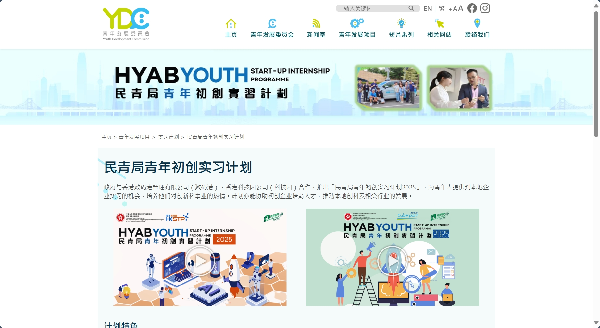

# 香港实习

## **科技初创**

本人因为想回香港发展，所以准备投递下香港的实习，如果对香港的科技初创实习感兴趣，可以看看这个计划。

### YSIP

<figure><figcaption></figcaption></figure>



**计划概述**

民青局青年初创实习计划（Youth Startup Internship Programme，简称YSIP）是一项由香港民政及青年事务局（民青局）与香港科技园公司（HKSTP）及香港数码港管理有限公司（数码港）合作推出的实习计划。该计划旨在为18至30岁的全日制专上学生提供在初创企业实习的机会，以培养他们对创新科技行业的兴趣，并帮助初创企业培育人才。

**计划目的**

* 为年轻人才提供在初创企业实习的机会，培养他们对创科行业的兴趣。
* 让初创企业与合适的青年人接触，帮助他们在园区公司累积工作经验、专业技能及发展人际网络。
* 缓解初创企业在招募人才方面所面临的挑战。
* 培育人才以及推动本地创新科技相关产业的发展。

**实习生资格**

* 年龄在18至30岁之间。
* 持有香港永久性居民身份证的全日制专上学生（包括副学位、学士学位或研究院课程）。
* 持有香港居民身份证的本地全日制专上学生（包括副学位、学士学位或研究院课程）。

**计划特色**

* **实习岗位**：计划全期提供200个实习岗位，涵盖数据分析、金融科技、生物科技、人工智能应用、业务拓展、市场推广及设计等领域。
* **工作模式**：参与的企业可以全职、兼职或混合模式聘请实习生。
* **薪酬资助**：每个实习岗位可获民青局提供每月最多11,200元的薪酬资助。
* **培训与活动**：实习生可以参与由数码港及科技园提供的一系列培训及创业体验活动，提升专业技能。
* **大湾区考察**：有机会到大湾区内地城市的初创企业考察，了解内地创业环境。

**实习期**

实习期为3至6个月。

**计划优点**

* 通过参与工作坊及企业参观等活动，提升专业技能及丰富行业知识。
* 与香港最大创科生态系统内的同侪、专业人士及领袖进行交流，扩展人际网络。
* 体验香港科技园公司独有的Work. Live. Play. Learn.文化。

**申请及查询**

* 详情请浏览香港科技园公司或数码港的官方网站。
* 面试安排将由参与计划的园区公司直接办理。

### **科技园公司实习**

[**https://www.hkstp.org/zh-cn/talent/early-career-and-internship/hkstp-internship-programme**](https://www.hkstp.org/zh-cn/talent/early-career-and-internship/hkstp-internship-programme)

<figure><figcaption></figcaption></figure>

**计划简介**

在香港科技园公司，我们相信人才是创新未来的关键！ 欢迎各学科的大学生申请香港科技园公司的暑期实习计划。&#x20;

这计划专为有创意，并希望投身全港最大的创新科技生态系统的年轻人才而设。 我们正寻找大学生加入这充满活力的创科生态系统，亲身体验在瞬息万变的创科行业中工作。&#x20;

实习生会获分配到香港科技园公司的不同部门工作，融入发展蓬勃的创新科技产业。 在六至八个星期中，你将会负责不同的项目为创科生态系统作出贡献。 除此之外，你还会参与各种活动，认识创科界中的同侪及领袖，与此交流。

\-------------------------------------------------------------------

## **大公司**

待更新

## **政职系**

政务职系实习计划的主要目的是让有志加入政务职系的学生可以**有机会与现职的政务主任（AO）共事**，汲取实际工作经验，了解AO的角色和使命，帮助他们为未来事业发展作出更好的规划。参加计划的学生将被派到一个决策局或部门，负责与AO职务相类似的工作。此外，学生亦会有机会**前往不同政府工作单位和/或公共机构参观**。

一直以来，政务职系实习生的反馈非常正面。实习经验不仅有意义，让他们大开眼界，还加深了他们对政务主任工作的认识，有助他们规划未来的事业发展。

截至报名时间：2.28！

薪酬水平为**每月港币11,200元（包括强积金供款）**。

工作时间**一般为每星期44小时**，但实际工作时间会视乎部门的运作需要而定。如果需要超时工作，可获补假作偿。

获聘用的申请人将会一律获得同样的聘用待遇（聘用期除外）。就现居于香港以外的申请人而言，如获聘用，将不会提供任何额外津贴，以支付其来港或离港的开支，或其留港期间的生活费用。\
\
